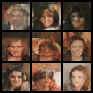

# SimpleDiffusion
A simple diffusion framework for comprehensive understanding.

Carry out a series training and record the training results. 

Compare the result with papers.

> we don’t understand what we can’t create. 

# Task 1 Unconditional Diffusion

- [x] Implement a DDPM and DDIM

- [x] Training On Mnist 

- [x]  that can generate Celeb64Image  20240509 

- [ ] Scalable Unet to 128 - 256 - 512 

for further details please refer to `./UnoncditionalDiffusion/experiments.pptx`  and `./UnoncditionalDiffusion/experiments.md` 

## Engineer Issues

在VAE和UnconditionalDiffusion的代码中，`DataModule`和`Trainer`类重复度是非常高的。 在开发的过程中，用工程文件的形式可以保证代码的一致性。 但是会增加代码的复杂度。 

第二点: 可以利用`importlib` +`omega_conf` 来简化类初始化。 参考VideoCrafter的实现。 

# Task 2 Latent Diffusion

- [ ] vae for compression 
  - [x] train on mnist 
- [ ] diffusion on other latent space: text , audio , mesh , etc.

## Implementation Plan

基于`UnconditionalDiffusion/main.py`采用相同的dataset，类似的Trainer设置。但是将scheduler,models(unet,vit),和vae分开。 

Trainer里面要增加encode和decode的部分。 扩散的过程中，只是特征空间变了，其他的不变。 

VAE的部分follow其他实现，写成first_stage_condition。 

# Task 3 Conditional Diffusion

- [ ] pretrained text model for condition
- [ ] different condition type: vanilla , token , cross attention etc. 
- [ ] multiple condition : zero-conv(controlnet)

# Task 4 Diffusion Transformer

- [ ] replace Unet with a transformer 

# Task 5 Video Diffusion

- [ ] insert temporal layer into diffusion 

# Other Resources for starting Diffusion

[DDPM implementation1](https://zhuanlan.zhihu.com/p/617895786)

[Course Level Diffusion Project: sast2023](https://github.com/Kevin-thu/sast2023-cv?tab=readme-ov-file)

- provide a latent diffusion base on Pytorch Lightning
- implement core functions yourself

[DiffusionFastForward: Train Diffusion from scratch](https://github.com/mikonvergence/DiffusionFastForward)

- provides some training costs record
- some other resources 

 

