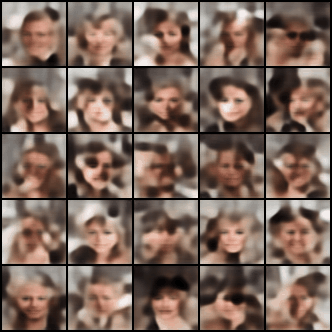

# SimpleDiffusion
A simple diffusion framework for comprehensive understanding.

Carry out a series training and record the training results. 

Compare the result with papers.


> we don’t understand what we can’t create. 


**Notice: This repo is under heavy development.**


# Task 1 Unconditional Diffusion

- [x] Implement a DDPM and DDIM

- [x] Training result On Mnist 


- [x]  that can generate Celeb64Image  20240509 


- [x] Scalable Unet to 128 - 256 - 512; refer to task2 

for further details please refer to `./UnoncditionalDiffusion/experiments.pptx`  and `./UnoncditionalDiffusion/experiments.md` 


## 1.1 Train on mnist 

```
cd UnconditionalDiffusion
python main.py --train --dataset mnist --batch_size=128 --imsize=32
```

## 1.2 Generation on mnist

```
# modify ckpt path in the ~ line 785
python main.py 
```


## 1.3 Train on Celeba

```
cd UnconditionalDiffusion
python main.py --train ---batch_size=128 --imsize=32
```


## Engineer Issues

### 关于工程抽象程度和实现设计的说明

本项目在不同的任务中会采用不同的设计方式，由任务复杂度和任务需求决定。 不同的抽象(解耦)程度会影响代码可读性，可维护性，可扩展性，以及工程效率。 我们常常需要再这些方面做权衡(trade-off)。

`Unconditional Diffusion`用一个`main.py`实现了所有功能，这是最简单，可读性最高的方式，但是可维护性可扩展性最差。大部分的Toturial导向的文件采用这种方式。

`Latent Diffusion`中，将`DataModule`和`Trainer`分离，将`model`和`loss`分离，使得代码更加可读，可维护，可扩展。具体实现上还是基于`Unconditional Diffusion.main.py`，如果对这个文件足够了解，那么理解`Latent Diffusion`则不会有很大的困难。 

在之后的实现中，会继续增加抽象程度，目前在计划中的抽象是:
    1. 增加`config.yaml`用来取代命令行传参
    2. 利用`importlib` +`omega_conf` 来简化类初始化。 参考VideoCrafter的实现。这样的好处会在实现之后详细说明。 

在分析了相对大量的工程文件和Toturial之后，注意到了一个被忽略的问题： **对实验结果的聚合和分析**
    1. 不同实验的代码的自动保存  
        2. 不同`config`下结果的自动化分析

### 关于超参数修改

1. 改超参数之前最好进行backup 尤其是进程并行的时候


### 自动搜索超参数的脚本

1. 依赖于被良好解耦的config
2. 然后设置好不同的config ->自动分配显卡资源等等 


# Task 2 Latent Diffusion


- [x] vae for compression 
  - [x] train on mnist 
  - [x] large scalable ae module
  - [x] attention in ae 
  - [ ] config for training 
  - [ ] lpips and discriminator loss
- [ ] diffusion on other latent space: text , audio , mesh , etc.


## 2.1 Train Latent DIffusion

```shell
#step 1 
python vae.py -b configs/train_vae.yaml
#step 2
#note: please add the path of pretrained vae to config 
#and also specify l
python main.py -b configs/train_ldm.yaml
```


## VAE results 

### result on mnist 


### result on celeb64 




## Full results of ldm on celeb


## Implementation Plan

在VAE和UnconditionalDiffusion的代码中，`DataModule`和`Trainer`类重复度是非常高的。 在开发的过程中，用工程文件的形式可以保证代码的一致性。 但是会增加代码的复杂度。 

基于`UnconditionalDiffusion/main.py`采用相同的dataset，类似的Trainer设置。但是将scheduler,models(unet,vit),和vae分开。 

Trainer里面要增加encode和decode的部分。 扩散的过程中，只是特征空间变了，其他的不变。 

VAE的部分follow其他实现，写成first_stage_condition。 


- 这个VAE结果还不够好，对于高频特征的重建比较差，需要加LPIPS和Discrimintor。
- config等配置问题还需要更加规范  代码还需要整理


# Task 3 Conditional Diffusion

- [ ] classifier guidance and classifier-free guidance 
- [ ] pretrained text model for condition
- [ ] different condition type: vanilla , token , cross attention etc. 
- [ ] multiple condition : zero-conv(controlnet)


## Implementation Plan

[classifier guidance simple tutorial](https://zhuanlan.zhihu.com/p/639548962)

- [ ] mnist的数据集可以做分类标签-扩展数据集部分的代码
- [ ] text2image的数据集
- [ ] 

# Task 4 Diffusion Transformer

- [ ] replace Unet with a transformer 
- [ ] 


# Task 5  Video Diffusion

- [ ] insert temporal layer into diffusion 
- [ ] temporal and spatial attention 


# Other Resources for starting Diffusion

[DDPM implementation1](https://zhuanlan.zhihu.com/p/617895786)

[Course Level Diffusion Project: sast2023](https://github.com/Kevin-thu/sast2023-cv?tab=readme-ov-file)

- provide a latent diffusion base on Pytorch Lightning
- implement core functions yourself

[DiffusionFastForward: Train Diffusion from scratch](https://github.com/mikonvergence/DiffusionFastForward)

- provides some training costs record
- some other resources 


# Acknowledgements

- thanks timechess (https://github.com/timechess) for adding nix and poetry environment in this project.


 

